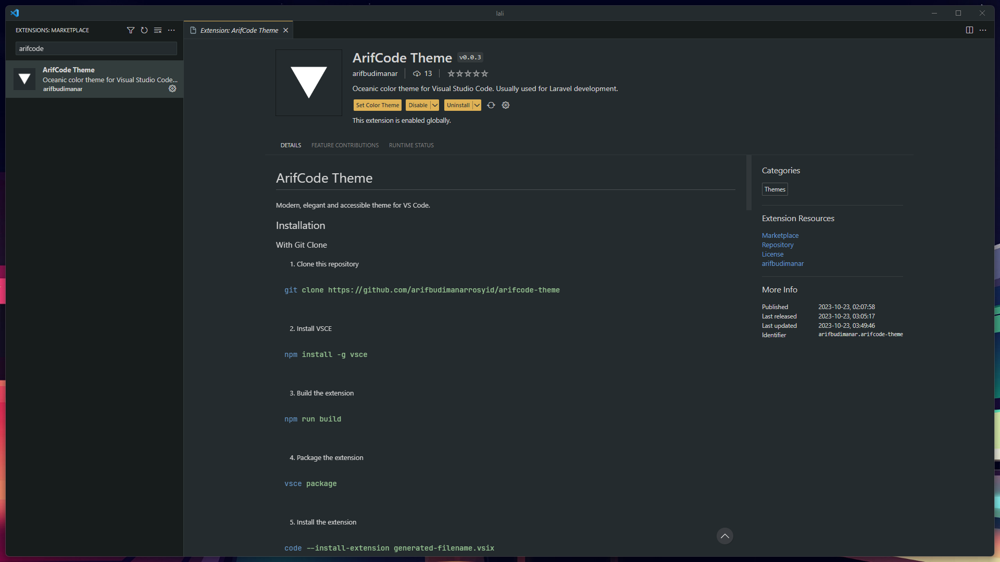
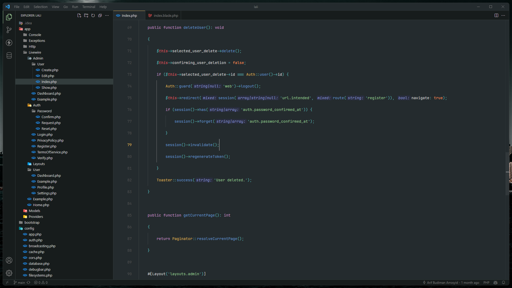
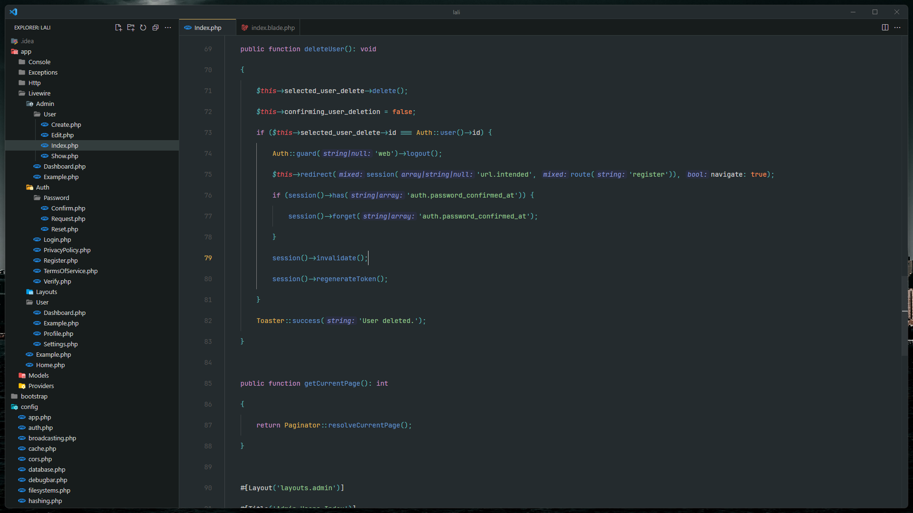
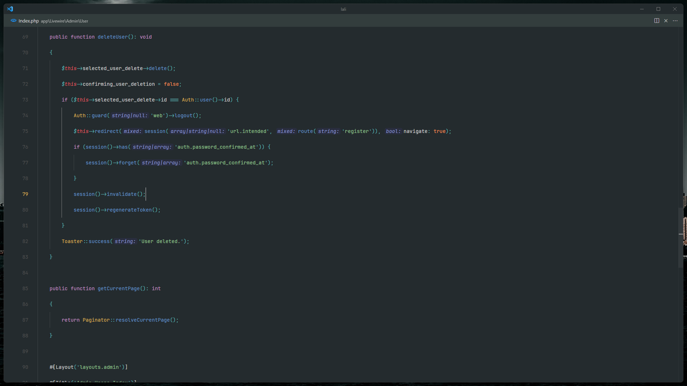
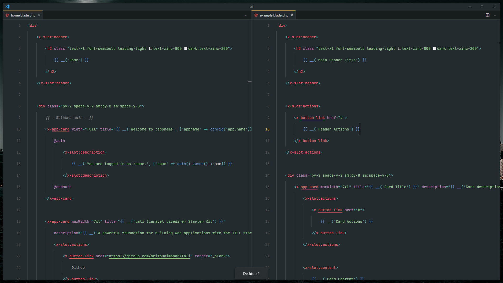
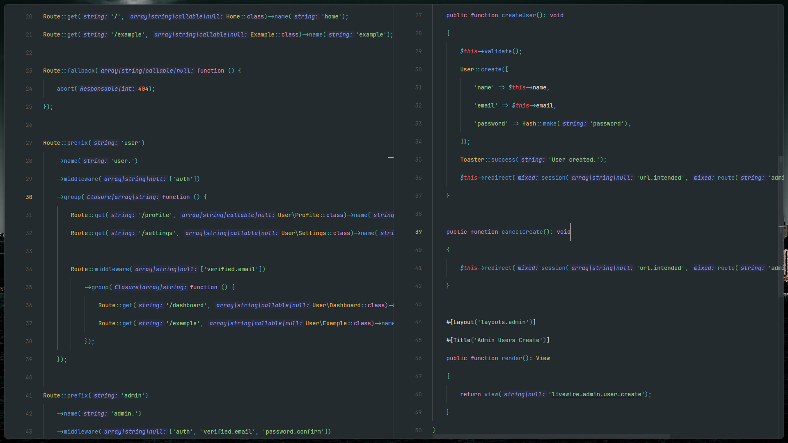
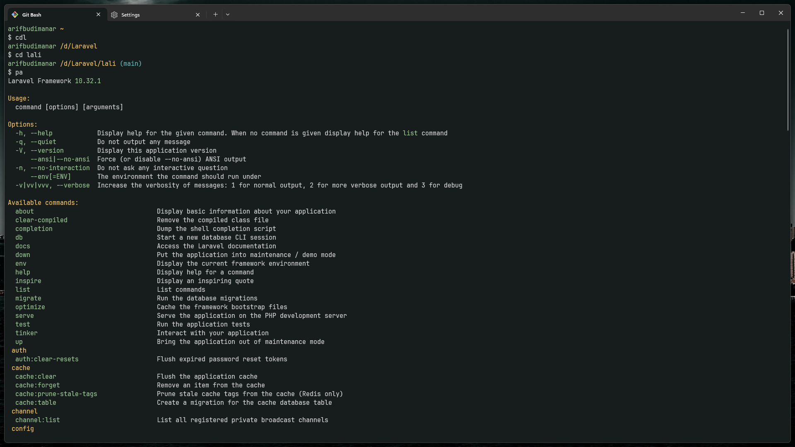

# ArifCode Theme

Oceanic dark theme for VS Code.

## Installation
### With Git Clone
1. Clone this repository
```bash
git clone https://github.com/arifbudimanar/arifcode-theme
```

2. Install VSCE
```bash
npm install -g vsce
```

3. Build the extension
```bash
npm run build
```

4. Package the extension
```bash
vsce package
```

5. Install the extension

```bash
code --install-extension generated-filename.vsix
```
### With VSIX
1. Download the latest [release](https://github.com/arifbudimanarrosyid/arifcode-theme/releases)
2. Install the extension
```bash
code --install-extension generated-filename.vsix
```
### With VS Code
1. Open the Extensions sidebar in VS Code
2. Search for `ArifCode Theme`
3. Click `Install`



## Preview
### Default

### Minimalist

### Zen Mode


## File
### HTML/CSS

### PHP


## Recommended Settings
### settings.json for minimalist setup
```json
{
    "editor.fontFamily": "JetBrains Mono",
    "editor.fontLigatures": true,
    "editor.lineHeight": 2.15,
    "workbench.activityBar.visible": false,
    "workbench.statusBar.visible": false,
    "workbench.editor.showTabs": false,
    "window.menuBarVisibility": "compact",

}
```

### keybindings.json
```json
[
    {
        "key": "alt+b",
        "command": "workbench.action.toggleActivityBarVisibility"
    },
    {
        "key": "alt+m",
        "command": "workbench.action.toggleMenuBar"
    },
    {
        "key": "alt+n",
        "command": "workbench.action.toggleStatusbarVisibility"
    }
]

```

## Windows Terminal

### settings.json
```json
{
    "background": "#242B2E",
    "black": "#242B2E",
    "blue": "#6699CC",
    "brightBlack": "#D4D4D4",
    "brightBlue": "#6699CC",
    "brightCyan": "#56B6C2",
    "brightGreen": "#99C794",
    "brightPurple": "#C594C5",
    "brightRed": "#FAC863",
    "brightWhite": "#D4D4D4",
    "brightYellow": "#FAC863",
    "cursorColor": "#D4D4D4",
    "cyan": "#5FB3B3",
    "foreground": "#D4D4D4",
    "green": "#99C794",
    "name": "ArifCode",
    "purple": "#C594C5",
    "red": "#E15A60",
    "selectionBackground": "#D4D4D4",
    "white": "#D4D4D4",
    "yellow": "#FAC863"
}

```