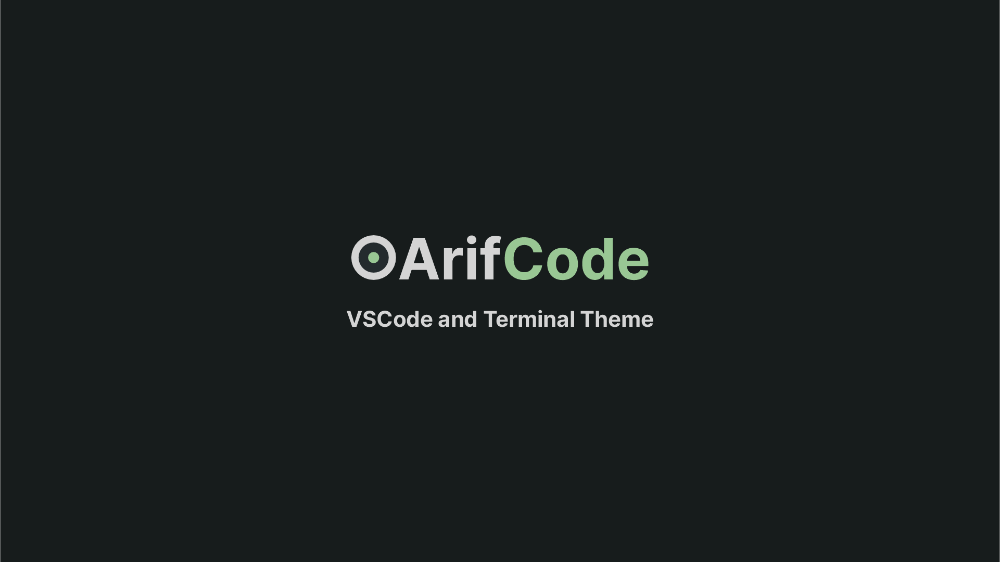

# ArifCode Theme
Oceanic dark theme for VS Code and Windows Terminal.

## Installation
### With Git Clone
1. Clone this repository
```bash
git clone https://github.com/arifbudimanar/arifcode-theme
```

2. Install VSCE
```bash
npm install -g vsce
```

3. Build the extension
```bash
npm run build
```

4. Package the extension
```bash
vsce package
```

5. Install the extension

```bash
code --install-extension generated-filename.vsix
```
### With VSIX
1. Download the latest [release](https://github.com/arifbudimanar/arifcode-theme/releases)
2. Install the extension
```bash
code --install-extension generated-filename.vsix
```
### With [VSCode](https://marketplace.visualstudio.com/items?itemName=arifbudimanar.arifcode-theme)
1. Open the Extensions sidebar in VS Code
2. Search for `ArifCode Theme`
3. Click `Install`

## Preview
### Default

### Minimalist

### Zen Mode


## File
### HTML/CSS

### PHP


## Recommended Settings
### settings.json
```json
{
	"[blade]": {
		"editor.defaultFormatter": "shufo.vscode-blade-formatter"
	},
	"[html]": {
		"editor.defaultFormatter": "vscode.html-language-features"
	},
	"[javascript]": {
		"editor.defaultFormatter": "esbenp.prettier-vscode"
	},
	"[javascriptreact]": {
		"editor.defaultFormatter": "esbenp.prettier-vscode"
	},
	"[json]": {
		"editor.defaultFormatter": "vscode.json-language-features"
	},
	"[jsonc]": {
		"editor.defaultFormatter": "vscode.json-language-features"
	},
	"[php]": {
		"editor.defaultFormatter": "open-southeners.laravel-pint"
		// "editor.defaultFormatter": "bmewburn.vscode-intelephense-client"
	},
	"[typescript]": {
		"editor.defaultFormatter": "vscode.typescript-language-features"
	},
	"blade.format.enable": true,
	"breadcrumbs.enabled": false,
	"database-client.telemetry.usesOnlineServices": false,
	"diffEditor.ignoreTrimWhitespace": false,
	"editor.bracketPairColorization.enabled": false,
	"editor.cursorBlinking": "phase",
	"editor.cursorSmoothCaretAnimation": "on",
	"editor.fontFamily": "'JetBrains Mono'",
	"editor.fontLigatures": true,
	"editor.formatOnSave": true,
	"editor.inlineSuggest.enabled": true,
	"editor.lineHeight": 3.15,
	// "editor.lineHeight": 2.15,
	// "editor.lineHeight": 48,
	"editor.matchBrackets": "never",
	"editor.minimap.enabled": false,
	"editor.renderLineHighlight": "none",
	"editor.renderWhitespace": "none",
	"editor.smoothScrolling": true,
	"emmet.excludeLanguages": [
		"markdown",
		"php"
	],
	"errorLens.messageTemplate": "$severity $source - $message  ",
	"explorer.compactFolders": false,
	"explorer.confirmDelete": false,
	"explorer.confirmDragAndDrop": false,
	"files.autoSave": "onWindowChange",
	"git-graph.graph.style": "angular",
	"git.confirmSync": false,
	"intelephense.telemetry.enabled": false,
	"intelephense.trace.server": "messages",
	"laravel-pint.enable": true,
	"laravel-pint.enableDebugLogs": true,
	"laravel-pint.preset": "laravel",
	"material-icon-theme.activeIconPack": "angular",
	"material-icon-theme.folders.color": "#808080",
	"material-icon-theme.folders.theme": "specific",
	"material-icon-theme.hidesExplorerArrows": true,
	"phpParameterHint.changeDelay": 0,
	"phpParameterHint.collapseHintsWhenEqual": true,
	"phpParameterHint.collapseTypeWhenEqual": true,
	"phpParameterHint.fontSize": 14,
	"phpParameterHint.hintTypeName": 1,
	"phpParameterHint.onChange": true,
	"phpParameterHint.onSave": false,
	"phpParameterHint.opacity": 1,
	"phpParameterHint.saveDelay": 0,
	"phpParameterHint.showDollarSign": false,
	"phpParameterHint.textEditorChangeDelay": 0,
	"phpParameterHint.verticalPadding": 0,
	"scm.diffDecorations": "gutter",
	"screencastMode.fontSize": 30,
	"screencastMode.keyboardOverlayTimeout": 5000,
	"screencastMode.verticalOffset": 2,
	"security.workspace.trust.untrustedFiles": "open",
	"telemetry.telemetryLevel": "off",
	"terminal.explorerKind": "external",
	"terminal.integrated.cursorBlinking": true,
	"terminal.integrated.cursorStyle": "line",
	"terminal.integrated.defaultProfile.windows": "Git Bash",
	"terminal.integrated.enableMultiLinePasteWarning": false,
	"terminal.integrated.fontFamily": "JetBrainsMono Nerd Font",
	"terminal.integrated.gpuAcceleration": "on",
	"typescript.inlayHints.enumMemberValues.enabled": true,
	"window.autoDetectColorScheme": true,
	"window.commandCenter": false,
	"window.menuBarVisibility": "compact",
	"window.title": "${rootName}",
	"workbench.activityBar.location": "hidden",
	"workbench.colorTheme": "ArifCode Theme",
	"workbench.iconTheme": "material-icon-theme",
	"workbench.layoutControl.enabled": false,
	"workbench.list.smoothScrolling": true,
	"workbench.preferredDarkColorTheme": "ArifCode Theme",
	"workbench.preferredLightColorTheme": "GitHub Light Default",
	"workbench.startupEditor": "none",
	"workbench.statusBar.visible": false,
	"workbench.tree.indent": 16,
	"zenMode.centerLayout": false,
	"zenMode.fullScreen": false,
	"zenMode.hideLineNumbers": false,
	"zenMode.showTabs": "single"
}
```

### keybindings.json
```json
[
    {
        "key": "alt+d",
        "command": "workbench.view.extension.github-cweijan-mysql"
    },
    {
        "key": "alt+t",
        "command": "workbench.view.extension.thunder-client"
    },
    {
        "key": "ctrl+shift+r",
        "command": "-workbench.view.extension.thunder-client"
    },
    {
        "key": "alt+b",
        "command": "workbench.action.toggleActivityBarVisibility"
    },
    {
        "key": "alt+m",
        "command": "workbench.action.toggleMenuBar"
    },
    {
        "key": "alt+n",
        "command": "workbench.action.toggleStatusbarVisibility"
    },
    {
        "key": "ctrl+n",
        "command": "-workbench.action.files.newUntitledFile"
    },
    {
        "key": "ctrl+n",
        "command": "explorer.newFile"
    },
    {
        "key": "ctrl+enter",
        "command": "-github.copilot.generate",
        "when": "editorTextFocus && github.copilot.activated"
    },
    {
        "key": "alt+g",
        "command": "git-graph.view"
    },
    {
        "key": "ctrl+alt+n",
        "command": "-extension.advancedNewFile"
    },
    {
        "key": "ctrl+0",
        "command": "workbench.action.zoomReset"
    },
    {
        "key": "ctrl+numpad0",
        "command": "-workbench.action.zoomReset"
    },
    {
        "key": "ctrl+enter",
        "command": "-github.copilot.generate",
        "when": "editorTextFocus && github.copilot.activated && !inInteractiveInput && !interactiveEditorFocused"
    },
    {
        "key": "alt+i",
        "command": "namespaceResolver.import",
        "when": "editorTextFocus"
    },
    {
        "key": "ctrl+k ctrl+c",
        "command": "workbench.files.action.collapseExplorerFolders"
    },
    {
        "key": "ctrl+k ctrl+shift+w",
        "command": "-workbench.action.closeAllGroups"
    },
    {
        "key": "ctrl+k ctrl+w",
        "command": "-workbench.action.closeAllEditors"
    },
    {
        "key": "ctrl+k w",
        "command": "-workbench.action.closeEditorsInGroup"
    },
    {
        "key": "ctrl+k ctrl+w",
        "command": "workbench.action.closeAllEditors"
    },
    {
        "key": "ctrl+k ctrl+shift+w",
        "command": "workbench.action.closeOtherEditors"
    },
    {
        "key": "ctrl+k ctrl+r",
        "command": "better-pest.run"
    },
    {
        "key": "ctrl+k ctrl+p",
        "command": "better-pest.run-previous"
    },
    {
        "key": "ctrl+k ctrl+f",
        "command": "better-pest.run-file"
    },
    {
        "key": "win+k win+f",
        "command": "-better-pest.run-file"
    },
    {
        "key": "win+k win+r",
        "command": "-better-pest.run"
    },
    {
        "key": "win+k win+p",
        "command": "-better-pest.run-previous"
    }
]
```

## Windows Terminal

### settings.json
```json
{
    "background": "#242B2E",
    "black": "#242B2E",
    "blue": "#6699CC",
    "brightBlack": "#D4D4D4",
    "brightBlue": "#6699CC",
    "brightCyan": "#56B6C2",
    "brightGreen": "#99C794",
    "brightPurple": "#C594C5",
    "brightRed": "#FAC863",
    "brightWhite": "#D4D4D4",
    "brightYellow": "#FAC863",
    "cursorColor": "#D4D4D4",
    "cyan": "#5FB3B3",
    "foreground": "#D4D4D4",
    "green": "#99C794",
    "name": "ArifCode",
    "purple": "#C594C5",
    "red": "#E15A60",
    "selectionBackground": "#D4D4D4",
    "white": "#D4D4D4",
    "yellow": "#FAC863"
}
```

## Bash Alias
```bash
# php artisan command
alias pa='php artisan'
alias pas='php artisan serve'
alias pam='php artisan migrate'
alias pamf='php artisan migrate:fresh'
alias pamfs='php artisan migrate:fresh --seed'
alias pads='php artisan db:seed'
alias paoc='php artisan optimize:clear'
alias pakg='php artisan key:generate'
alias pat='php artisan test'
alias pint='./vendor/bin/pint'
alias pest='./vendor/bin/pest'

# composer command
alias cu='composer update'
alias ci='composer install'
alias cr='composer require'
alias cdo='composer dump-autoload --optimize'

# npm command
alias ni='npm install'
alias nu='npm update'
alias nrd='npm run dev'
alias nrb='npm run build'

# navigation command
alias ll='ls -alF'
alias la='ls -A'
alias l='ls -CF'
alias ..='cd ..'
alias ...='cd ../..'
alias ....='cd ../../..'
alias .....='cd ../../../..'
alias cdc='cd /c'
alias cdd='cd /d'
alias cdh='cd ~'
alias cdl='cd /d/Laravel'
alias bashrc='code ~/.bashrc'
alias bashrcs='source ~/.bashrc'

# other command
alias c='clear'
alias st='speedtest'
alias hosts='code C:/Windows/System32/drivers/etc/hosts'
```